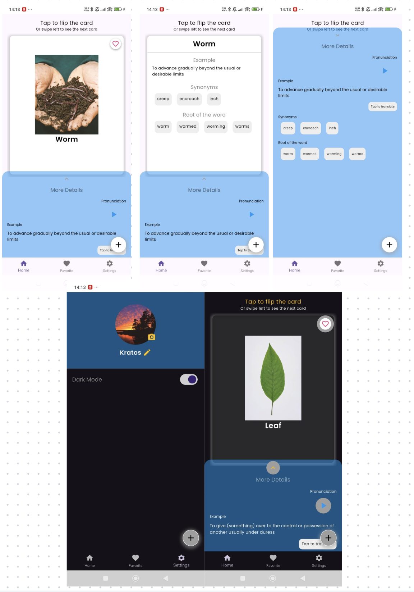

# FlashCard

A Flutter app for learning and managing vocabulary with flashcards, pronunciation audio, and more.

## Flash card


## Features

- Add, view, and manage flashcards
- Fetch word definitions, synonyms, antonyms, and stems from an API
- Play pronunciation audio for words
- Mark favorite words
- Persistent storage using ObjectBox
- Responsive UI

## Getting Started

### Prerequisites

- [Flutter SDK](https://flutter.dev/docs/get-started/install)
- Dart SDK (comes with Flutter)
- A device or emulator

### Installation

1. **Clone the repository:**
   ```bash
   git clone https://github.com/yourusername/flash_card.git
   cd flash_card
   ```

2. **Install dependencies:**
   ```bash
   flutter pub get
   ```

3. **Generate ObjectBox bindings:**
   ```bash
   flutter pub run build_runner build
   ```

4. **Run the app:**
   ```bash
   flutter run
   ```

## Project Structure

- `lib/main.dart` - App entry point
- `lib/provider/` - State management (Provider)
- `lib/repo/` - Data fetching, ObjectBox setup, models
- `lib/screens/` - UI screens and widgets

## Dependencies

- [provider](https://pub.dev/packages/provider)
- [objectbox](https://pub.dev/packages/objectbox)
- [just_audio](https://pub.dev/packages/just_audio)
- [http](https://pub.dev/packages/http)
- [path_provider](https://pub.dev/packages/path_provider)
- [path](https://pub.dev/packages/path)
- [geolocator](https://pub.dev/packages/geolocator)
- [shared_preferences](https://pub.dev/packages/shared_preferences)
- [intl](https://pub.dev/packages/intl)

## API Keys

Some features require API keys (e.g., for dictionary or geolocation APIs).  
Add your keys in the appropriate files as environment variables or constants.

## License

[MIT](LICENSE)

---

*Happy learning!*
